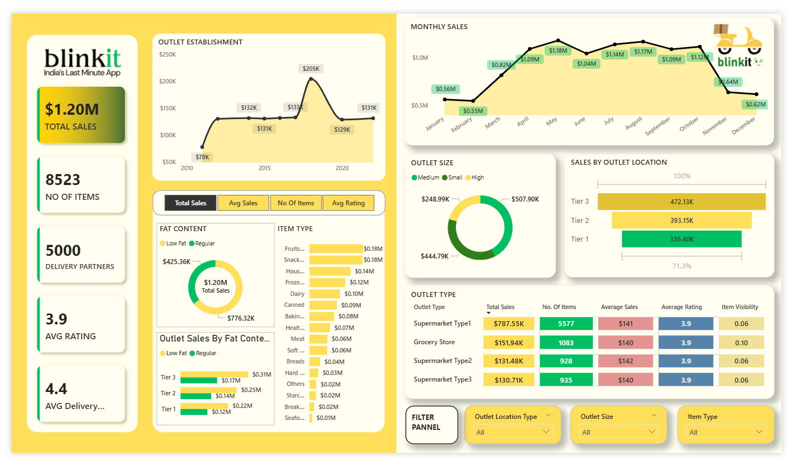

# Blinkit Sales Analytics Dashboard (Power BI)

## 📊 Project Overview

This project presents an interactive **Blinkit Sales Analytics Dashboard** developed using **Microsoft Power BI**.  
The dashboard converts raw sales data into meaningful insights to help analyze business performance, product demand, and outlet trends.

The dashboard enables users to explore sales patterns, outlet performance, and product category trends through interactive visualizations and filters.

---

## 🖼 Dashboard Preview

---

## 🎯 Project Objectives

- Analyze Blinkit sales performance
- Identify high-performing product categories
- Compare outlet performance across locations
- Evaluate product characteristics such as fat content
- Provide actionable insights for business decision-making

---

## 📈 Key Performance Indicators (KPIs)

The dashboard highlights important business metrics:

| KPI | Value |
|----|------|
| Total Sales | $1.20M |
| Total Items | 8523 |
| Delivery Partners | 5000 |
| Average Rating | 3.9 |
| Average Delivery Time | 4.4 Min |

These KPIs provide a quick overview of Blinkit's operational performance.

---

## 🔍 Key Business Insights

- Monthly sales increase significantly from **March to May** and decline toward year-end.
- **Medium-sized outlets** contribute the highest sales revenue.
- **Tier 3 cities** generate the highest sales compared to Tier 1 and Tier 2 cities.
- **Fruits, snacks, and household items** are the top-performing product categories.
- **Regular fat products** generate higher sales than low-fat products.
- **Supermarket Type1 outlets** generate the highest total sales.

These insights help businesses understand customer demand patterns and optimize operations.

---

## 📊 Dashboard Features

- KPI summary cards
- Monthly sales trend analysis
- Outlet establishment performance
- Product category performance
- Outlet location comparison
- Fat content analysis
- Outlet type performance table
- Interactive filters for dynamic analysis

---

## 🛠 Tools and Technologies Used

- **Power BI** – Data visualization and dashboard creation  
- **Power Query** – Data cleaning and transformation  
- **DAX (Data Analysis Expressions)** – Calculated measures and metrics  
- **CSV Dataset** – Blinkit dataset  

---
